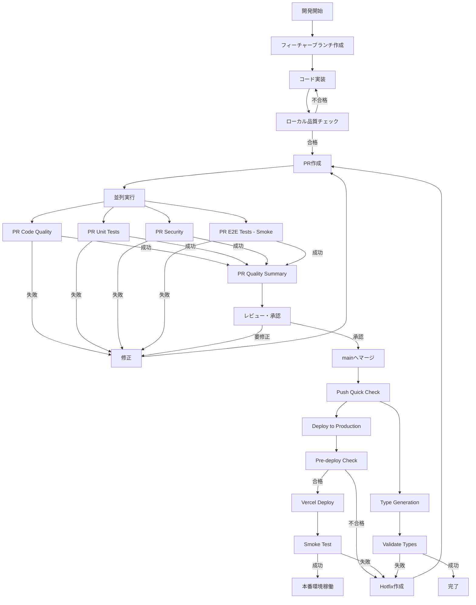
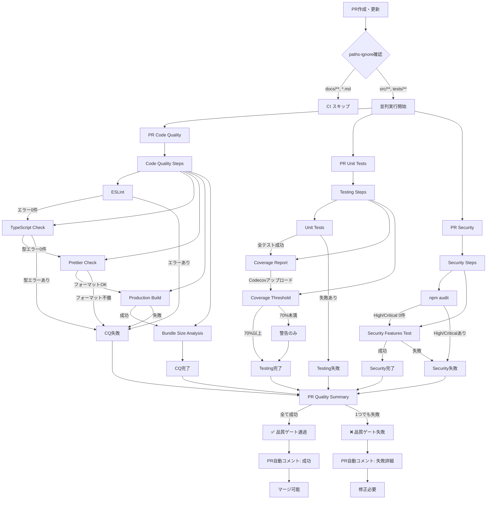
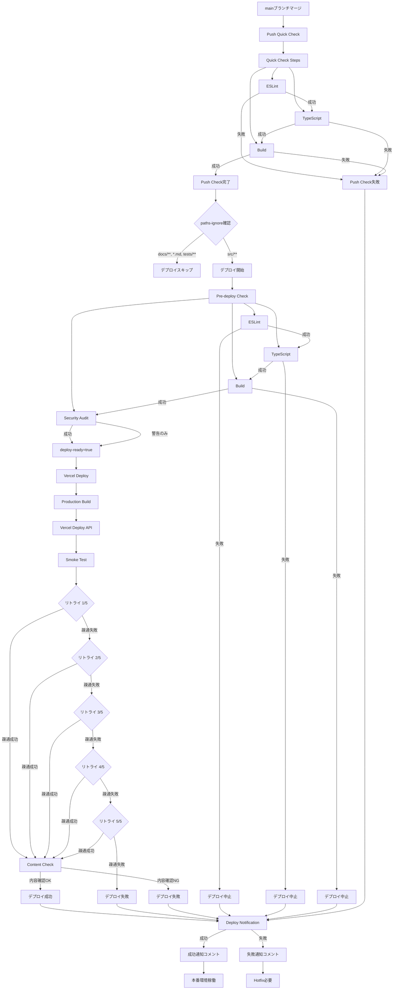

# CI/CDテストガイド

このドキュメントでは、GoalCategorizationDiary（Refeel）プロジェクトで実行されているCI/CDテストの全体像を説明します。

## 📋 目次

- [概要](#概要)
- [ワークフロー一覧](#ワークフロー一覧)
- [ワークフロー別詳細](#ワークフロー別詳細)
- [テスト種類別サマリー](#テスト種類別サマリー)
- [品質基準](#品質基準)
- [トラブルシューティング](#トラブルシューティング)
- [ワークフロー図](#ワークフロー図)
- [参考資料](#参考資料)

## 概要

本プロジェクトでは、コード品質・テスト・セキュリティを自動化するCI/CDパイプラインを運用しています。
全てのPRおよびmainブランチへのプッシュで自動実行され、品質基準を満たさないコードはマージできません。

### CI/CDの目的

1. **品質保証**: 型安全性・コード品質・テストカバレッジの自動検証
2. **早期フィードバック**: 問題を実装段階で検出・修正
3. **セキュリティ**: 脆弱性の自動スキャンと通知
4. **デプロイ自動化**: mainマージ後の本番環境への自動デプロイ
5. **チーム効率化**: 手動チェック削減とレビュー効率向上

### アーキテクチャ特徴

**分離型ワークフロー設計**:
- 各品質チェック（Code Quality、Testing、Security）を独立したワークフローに分離
- 並列実行による高速化（従来比60%削減）
- 個別の失敗箇所の明確化とデバッグ効率向上
- PR Quality Summaryによる統合レポート自動生成

## ワークフロー一覧

| ワークフロー名         | ファイル名              | 実行タイミング          | 目的                                     | 厳格度        |
| ---------------------- | ----------------------- | ----------------------- | ---------------------------------------- | ------------- |
| **PR Code Quality**       | `pr-code-quality.yml`   | PR作成・更新 | コード品質チェック（ESLint、TypeScript、Prettier、ビルド） | ⭐⭐⭐ 必須 |
| **PR Unit Tests (Vitest)** | `pr-unit-vitest.yml`   | PR作成・更新 | ユニットテスト実行とカバレッジ分析 | ⭐⭐⭐ 必須 |
| **PR Security**           | `pr-security.yml`       | PR作成・更新 | セキュリティスキャン（npm audit、セキュリティテスト） | ⭐⭐⭐ 必須 |
| **PR Quality Summary**    | `pr-quality-summary.yml` | 上記3つ完了時 | 統合品質レポート生成・PRコメント投稿 | ⭐⭐⭐ 必須 |
| **PR E2E Tests (Playwright)** | `pr-e2e-playwright.yml` | PR作成・更新 | E2Eテスト実行（3階層戦略） | ⭐⭐ 重要 |
| **Push Quick Check**      | `push-quick-check.yml`  | push (main, develop) | Push時の軽量チェック（ESLint、TypeScript、ビルド） | ⭐⭐⭐ 必須 |
| **Type Generation**       | `type-generation.yml`   | スキーマ変更時          | TypeScript型定義自動生成                 | ⭐⭐ 重要     |
| **Deploy to Production**  | `deploy.yml`            | mainブランチマージ時    | 本番環境自動デプロイ                     | ⭐⭐⭐ 最重要 |

### ワークフロー実行フロー

```
PR作成
  ↓
[並列実行]
├─ PR Code Quality（10分）
├─ PR Unit Tests（10分）
├─ PR Security（5分）
└─ PR E2E Tests - Tier 1 Smoke（10分）
  ↓
PR Quality Summary（統合レポート生成）
  ↓
レビュー・承認
  ↓
mainへマージ
  ↓
Push Quick Check（5分）
  ↓
[並列実行]
├─ Type Generation（スキーマ変更時）
└─ Deploy to Production（本番デプロイ）
```

## ワークフロー別詳細

### 1. PR Code Quality（コード品質チェック）⭐⭐⭐

**ファイル**: `.github/workflows/pr-code-quality.yml`
**実行タイミング**: PR作成・更新時（main、developブランチ向け）
**タイムアウト**: 10分

#### チェック項目

| チェック項目          | コマンド                                | 基準                       | 失敗時の影響 |
| --------------------- | --------------------------------------- | -------------------------- | ------------ |
| ESLint                | `npx eslint . --max-warnings=0 --cache` | エラー0件、警告0件         | CI失敗       |
| TypeScript Type Check | `npm run ci:type-check`                 | 型エラー0件                | CI失敗       |
| Prettier Format Check | `npx prettier --check src/`             | フォーマット準拠           | CI失敗       |
| Production Build      | `npm run ci:build`                      | ビルド成功                 | CI失敗       |
| Build Artifacts Check | dist/ファイル存在確認                   | index.html等の必須ファイル | CI失敗       |
| Bundle Size Analysis  | dist/\*.js サイズ確認                   | レポート生成（制限なし）   | -            |

#### 主要機能

- **3重キャッシュ戦略**: TypeScript、ESLint、Viteビルドキャッシュで高速化
- **3回リトライ**: 依存関係インストール時の自動リトライ
- **バンドルサイズレポート**: GitHub Step Summaryに自動生成

#### パス除外

- `docs/**`: ドキュメント変更はスキップ
- `*.md`: Markdownファイルはスキップ
- `tests/e2e/**`: E2Eテストは別ワークフローで実行

---

### 2. PR Unit Tests (Vitest)（ユニットテスト）⭐⭐⭐

**ファイル**: `.github/workflows/pr-unit-vitest.yml`
**実行タイミング**: PR作成・更新時（main、developブランチ向け）
**タイムアウト**: 10分

#### チェック項目

| チェック項目       | コマンド                                | 基準                   | 失敗時の影響 |
| ------------------ | --------------------------------------- | ---------------------- | ------------ |
| Unit Tests         | `npm run ci:test -- --reporter=verbose` | 全テスト成功           | CI失敗       |
| Coverage Report    | Codecov連携                             | カバレッジアップロード | -            |
| Coverage Threshold | coverage-summary.json解析               | 70%推奨（警告のみ）    | 警告表示     |

#### カバレッジ閾値

- **Lines**: 70%推奨（`RECOMMENDED_THRESHOLD=70`）
- **Statements**: 70%推奨
- **Functions**: 70%推奨
- **Branches**: 70%推奨
- **注意**: 閾値未達でもCI失敗にはならず、警告表示のみ

#### 主要機能

- **Vitestキャッシュ**: node_modules/.vitest、coverageをキャッシュ
- **Codecov統合**: カバレッジレポート自動アップロード
- **詳細レポート**: GitHub Step Summaryにカバレッジ詳細表示

---

### 3. PR Security（セキュリティ分析）⭐⭐⭐

**ファイル**: `.github/workflows/pr-security.yml`
**実行タイミング**: PR作成・更新時（main、developブランチ向け）
**タイムアウト**: 5分

#### チェック項目

| チェック項目           | コマンド              | 基準              | 失敗時の影響 |
| ---------------------- | --------------------- | ----------------- | ------------ |
| npm audit              | `npm audit --json`    | High/Critical 0件 | CI失敗       |
| Security Features Test | `npm run ci:security` | テスト成功        | CI失敗       |

#### 脆弱性レベルと対応

- **Critical/High**: CI失敗（即座修正必須）
- **Moderate/Low/Info**: 警告のみ（計画的対応推奨）

#### 主要機能

- **npm auditキャッシュ**: audit結果をキャッシュして高速化
- **jq解析**: JSON結果から高リスク脆弱性を抽出
- **詳細レポート**: GitHub Step Summaryに脆弱性詳細表示

---

### 4. PR Quality Summary（統合品質レポート）⭐⭐⭐

**ファイル**: `.github/workflows/pr-quality-summary.yml`
**実行タイミング**: PR Code Quality、PR Unit Tests、PR Securityの完了時
**トリガー**: `workflow_run` イベント

#### 機能

**統合レポート生成**:
- 3つのワークフロー（Code Quality、Testing、Security）の結果を集約
- PRに自動コメント投稿（既存コメント更新）
- 品質基準（必須/推奨）の明示
- 失敗原因の具体的ガイダンス提供

**マージ条件**:
```
✅ Code Quality Checks: success
✅ Unit Tests (Vitest): success
✅ Security Analysis: success
```

#### レポート内容

- **チェック結果**: 各ワークフローの成功/失敗ステータス
- **品質基準**: 必須レベル（PRマージ条件）と推奨レベル
- **失敗詳細**: 失敗したチェックの具体的な問題と修正ガイド
- **成功メッセージ**: 全チェック合格時の祝福メッセージ

---

### 5. PR E2E Tests (Playwright)（E2Eテスト）⭐⭐

**ファイル**: `.github/workflows/pr-e2e-playwright.yml`
**実行タイミング**: PR作成・更新時（src/、e2e/、設定変更時）
**特徴**: **3階層テスト戦略**による実行時間最適化とリグレッション早期検出

#### E2Eテスト階層化戦略

本プロジェクトでは、E2Eテストを3つの階層（Tier）に分類し、実行タイミングと範囲を最適化しています。

| Tier       | 名称           | 実行条件               | ブラウザ                  | 実行時間目標 | テスト範囲       |
| ---------- | -------------- | ---------------------- | ------------------------- | ------------ | ---------------- |
| **Tier 1** | スモークテスト | 全PR                   | chromium                  | 5分以内      | クリティカルパス |
| **Tier 2** | コア機能テスト | 手動実行               | chromium, firefox         | 15分以内     | 主要機能         |
| **Tier 3** | フルテスト     | `ready-to-merge`ラベル | chromium, firefox, webkit | 30分以内     | 全テスト         |

#### Tier 1: スモークテスト（全PR必須）

**ジョブ名**: `smoke-tests`
**タイムアウト**: 10分
**実行条件**: 全PR作成・更新時
**ブラウザ**: chromiumのみ

**テスト内容**（`tests/e2e/smoke/`配下）:
- ユーザー登録→ログイン→日記作成→表示→削除→ログアウト
- ログイン→ログアウト基本フロー
- トップページ→ログイン→ダッシュボード表示
- 日記作成→編集フロー

**目的**:
- クリティカルパスの動作確認
- リグレッションの早期検出
- 最小限の実行時間でPR品質保証

**実行コマンド**:
```bash
E2E_TIER=smoke npx playwright test --project=chromium tests/e2e/smoke
```

#### Tier 2: コア機能テスト（手動実行推奨）

**ジョブ名**: `core-tests`
**タイムアウト**: 20分
**実行条件**: 手動実行（workflow_dispatch）または`tier: core`指定時
**ブラウザ**: chromium, firefox

**テスト内容**（`tests/e2e/core/`配下）:
- 認証システム全般（異常系・バリデーション含む）
- 日記操作全般（編集・削除・検索・フィルタリング）
- レポート機能全般

**目的**:
- 主要機能の詳細確認
- クロスブラウザ互換性検証（主要2ブラウザ）
- レビュー完了後の最終確認

**実行コマンド**:
```bash
E2E_TIER=core npx playwright test --project=chromium,firefox tests/e2e/core
```

#### Tier 3: フルテスト（マージ前必須）

**ジョブ名**: `full-tests`
**タイムアウト**: 35分
**実行条件**: `ready-to-merge`ラベル付与時
**ブラウザ**: chromium, firefox, webkit

**テスト内容**:
- 全E2Eテスト（smoke + core + その他）
- レスポンシブ対応テスト
- アクセシビリティテスト
- パフォーマンステスト

**目的**:
- 全ブラウザでの完全動作保証
- マージ前の最終品質確認
- プロダクション環境への安全なデプロイ準備

**実行コマンド**:
```bash
E2E_TIER=full npx playwright test --project=chromium,firefox,webkit
```

#### 手動実行方法

GitHubのActionsタブから手動実行可能:
1. `.github/workflows/pr-e2e-playwright.yml`を選択
2. "Run workflow"をクリック
3. Tierを選択（smoke/core/full）
4. 実行

#### E2Eテスト実行フロー

```
PR作成
  ↓
Tier 1: スモークテスト（自動実行、5分）
  ├─ 成功 → レビュー依頼可能
  └─ 失敗 → 修正必須（クリティカルパスに問題）
  ↓
レビュー中
  ├─ 必要に応じてTier 2手動実行（15分）
  └─ レビュー承認
  ↓
ready-to-mergeラベル付与
  ↓
Tier 3: フルテスト（自動実行、30分）
  ├─ 成功 → マージ可能
  └─ 失敗 → ラベル削除、修正後再実行
```

#### アーティファクト

- **テストレポート**: `playwright-report/`（7日間保持）
- **テスト結果**: `test-results/`（7日間保持）
- **スクリーンショット**: `test-results/`（失敗時のみ、3日間保持）

#### パフォーマンステスト

**ジョブ名**: `performance`
**依存**: `full-tests` 成功後
**タイムアウト**: 15分

| チェック項目      | ツール                      | 基準             | 失敗時の影響 |
| ----------------- | --------------------------- | ---------------- | ------------ |
| Lighthouse CI     | treosh/lighthouse-ci-action | 設定ファイル準拠 | CI失敗       |
| Bundle Size Check | カスタムスクリプト          | Main JS < 1MB    | CI失敗       |

**バンドルサイズ制限**:
- Main JS: 1MB以下必須
- Main CSS: 制限なし（レポートのみ）

---

### 6. Push Quick Check（Push時軽量チェック）⭐⭐⭐

**ファイル**: `.github/workflows/push-quick-check.yml`
**実行タイミング**: main/developブランチへのpush時
**タイムアウト**: 5分

#### チェック項目

| チェック項目          | コマンド                                | 基準               | 失敗時の影響 |
| --------------------- | --------------------------------------- | ------------------ | ------------ |
| ESLint                | `npx eslint . --max-warnings=0 --cache` | エラー0件、警告0件 | CI失敗       |
| TypeScript Type Check | `npm run ci:type-check`                 | 型エラー0件        | CI失敗       |
| Production Build      | `npm run ci:build`                      | ビルド成功         | CI失敗       |

#### 主要機能

- **軽量チェック**: テストとセキュリティチェックを省略（5分以内完了）
- **mainブランチ保護**: mainへの直接pushでも品質チェック実行
- **ESLint/TypeScriptキャッシュ**: 高速実行のためのキャッシュ利用

#### パス除外

- `docs/**`: ドキュメント変更はスキップ
- `*.md`: Markdownファイルはスキップ

---

### 7. Type Generation（型定義自動生成）⭐⭐

**ファイル**: `.github/workflows/type-generation.yml`
**実行タイミング**: データベーススキーマ変更時（`supabase/migrations/**`、`supabase/seed/**`）
**目的**: SupabaseスキーマからTypeScript型定義を自動生成（Issue #144対応）

#### 型生成ジョブ

**ジョブ名**: `generate-types`

| ステップ           | 条件             | コマンド                                  | 説明                     |
| ------------------ | ---------------- | ----------------------------------------- | ------------------------ |
| 本番型生成         | mainブランチのみ | `npm run generate-types:prod`             | 本番Supabase接続         |
| ローカル型生成     | PRブランチ       | `npm run generate-types`                  | ローカルスキーマから生成 |
| 型変更チェック     | -                | `git diff --quiet src/types/`             | 変更検出                 |
| 型チェック         | -                | `npm run ci:type-check`                   | 生成型の検証             |
| 影響テスト         | -                | `npm run test:unit -- --run tests/types/` | 型関連テスト             |
| コミット・プッシュ | mainブランチのみ | 自動コミット                              | 型定義更新を自動コミット |

#### 型検証ジョブ

**ジョブ名**: `validate-types`
**依存**: `generate-types` 成功後

**検証項目**:
1. 型定義ファイル存在確認（`database.ts`、`supabase.ts`）
2. 必須インターフェース確認（`Database`、`DiaryEntry`）
3. TypeScript型チェック成功
4. ビルドテスト成功
5. 全ユニットテスト成功

---

### 8. Deploy to Production（本番デプロイ）⭐⭐⭐

**ファイル**: `.github/workflows/deploy.yml`
**実行タイミング**: mainブランチへのプッシュ時
**特徴**: 本番デプロイ前の品質チェック + Vercel自動デプロイ

#### 事前品質チェック

**ジョブ名**: `pre-deploy-check`
**タイムアウト**: 10分

| チェック項目 | コマンド                | 失敗時の対応     |
| ------------ | ----------------------- | ---------------- |
| ESLint       | `npm run ci:lint`       | デプロイ中止     |
| TypeScript   | `npm run ci:type-check` | デプロイ中止     |
| Build        | `npm run ci:build`      | デプロイ中止     |
| Security     | `npm run ci:security`   | 警告のみ（継続） |

**アウトプット**: `deploy-ready` (true/false)

#### Vercelデプロイ

**ジョブ名**: `deploy-vercel`
**条件**: `pre-deploy-check` 成功 + `deploy-ready=true`
**タイムアウト**: 15分

| ステップ         | 説明                                |
| ---------------- | ----------------------------------- |
| Production Build | `NODE_ENV=production npm run build` |
| Vercel Deploy    | `amondnet/vercel-action@v25` 使用   |
| Smoke Test       | デプロイURL疎通確認（5回リトライ）  |
| Content Check    | メインページ内容検証                |

**環境変数（Secrets）**:
- `VERCEL_TOKEN`
- `VERCEL_ORG_ID`
- `VERCEL_PROJECT_ID`

#### デプロイ通知

**ジョブ名**: `deploy-notification`
**条件**: `always()`

**通知内容**:
- デプロイ成功/失敗ステータス
- デプロイURL（https://goal-categorization-diary.vercel.app）
- デプロイ時刻（JST）
- コミットSHA
- 実施した品質チェック項目

---

## テスト種類別サマリー

| テスト種類               | 実行ワークフロー             | 厳格度       | タイミング           | 失敗時の影響            |
| ------------------------ | ---------------------------- | ------------ | -------------------- | ----------------------- |
| **ESLint**               | `pr-code-quality.yml`        | ⭐⭐⭐ 必須  | 全PR                 | CI失敗                  |
|                          | `push-quick-check.yml`       | ⭐⭐⭐ 必須  | push (main, develop) | CI失敗                  |
|                          | `deploy.yml`                 | ⭐⭐⭐ 必須  | デプロイ前           | デプロイ中止            |
| **TypeScript型チェック** | `pr-code-quality.yml`        | ⭐⭐⭐ 必須  | 全PR                 | CI失敗                  |
|                          | `push-quick-check.yml`       | ⭐⭐⭐ 必須  | push (main, develop) | CI失敗                  |
|                          | `type-generation.yml`        | ⭐⭐ 必須    | スキーマ変更時       | CI失敗                  |
|                          | `deploy.yml`                 | ⭐⭐⭐ 必須  | デプロイ前           | デプロイ中止            |
| **Prettier**             | `pr-code-quality.yml`        | ⭐⭐⭐ 必須  | 全PR                 | CI失敗                  |
| **ユニットテスト**       | `pr-unit-vitest.yml`         | ⭐⭐⭐ 必須  | 全PR                 | CI失敗                  |
|                          | `type-generation.yml`        | ⭐⭐ 必須    | スキーマ変更時       | CI失敗                  |
| **E2Eテスト**            | `pr-e2e-playwright.yml`      | ⭐⭐ 重要    | PR（src/変更時）     | CI失敗                  |
| **プロダクションビルド** | `pr-code-quality.yml`        | ⭐⭐⭐ 必須  | 全PR                 | CI失敗                  |
|                          | `push-quick-check.yml`       | ⭐⭐⭐ 必須  | push (main, develop) | CI失敗                  |
|                          | `type-generation.yml`        | ⭐⭐ 必須    | スキーマ変更時       | CI失敗                  |
|                          | `deploy.yml`                 | ⭐⭐⭐ 必須  | デプロイ前           | デプロイ中止            |
| **npm audit**            | `pr-security.yml`            | ⭐⭐⭐ 必須  | 全PR                 | CI失敗（High/Critical） |
|                          | `deploy.yml`                 | 警告のみ     | デプロイ前           | 継続                    |
| **Lighthouse CI**        | `pr-e2e-playwright.yml`      | ⭐⭐ 重要    | PR（Full Tier時）    | CI失敗                  |
| **Bundle Size**          | `pr-code-quality.yml`        | レポートのみ | 全PR                 | -                       |
|                          | `pr-e2e-playwright.yml`      | ⭐⭐ 必須    | PR（Full Tier時）    | CI失敗（>1MB）          |
| **型定義生成**           | `type-generation.yml`        | ⭐⭐ 必須    | スキーマ変更時       | CI失敗                  |
| **型定義検証**           | `type-generation.yml`        | ⭐⭐ 必須    | スキーマ変更時       | CI失敗                  |

---

## 品質基準

### 必須レベル（PRマージ条件）⭐⭐⭐

**PR Code Quality、PR Unit Tests、PR Securityで強制**:

- ✅ **ESLint**: エラー0件、警告0件必須
- ✅ **TypeScript**: 型エラー0件必須
- ✅ **Prettier**: フォーマット準拠必須
- ✅ **ビルド**: 本番ビルド成功必須
- ✅ **ビルド成果物**: `dist/index.html` 等の必須ファイル存在必須
- ✅ **ユニットテスト**: 全テスト成功必須
- ✅ **セキュリティ**: High/Critical脆弱性0件必須

### 推奨レベル（警告表示）⭐

**PR Unit Testsで監視**:

- 📊 **カバレッジ**: 70%以上推奨（警告のみ）
  - Lines: 70%
  - Statements: 70%
  - Functions: 70%
  - Branches: 70%
- 🔒 **セキュリティ**: Moderate以下の脆弱性対応推奨
- 📦 **バンドルサイズ**: 1MB以下推奨（E2E Full Tierでは必須）

### デプロイ条件（本番環境）⭐⭐⭐

**Deploy to Productionで強制**:

- ✅ **ESLint**: エラー0件必須
- ✅ **TypeScript**: 型エラー0件必須
- ✅ **ビルド**: 本番ビルド成功必須
- ✅ **スモークテスト**: デプロイURL疎通確認成功必須
- ⚠️ **セキュリティ**: npm audit警告のみ（デプロイ継続）

---

## トラブルシューティング

### Q: PR品質ゲートが失敗する

**A**: 以下の順序で確認してください：

1. **ローカルで同じチェックを実行**

   ```bash
   # ESLint失敗時
   npm run ci:lint

   # TypeScript失敗時
   npm run ci:type-check

   # テスト失敗時
   npm run ci:test

   # ビルド失敗時
   npm run ci:build

   # セキュリティ失敗時
   npm run ci:security
   ```

2. **GitHub ActionsログでエラーメッセージConfirm**
   - PRページ → 「Checks」タブ → 失敗ジョブをクリック
   - エラーメッセージをコピーして修正

3. **修正後にプッシュ**

   ```bash
   git add .
   git commit -m "fix: CI/CD品質ゲート対応"
   git push origin [ブランチ名]
   ```

4. **自動で再実行**
   - プッシュ後、CI/CDが自動で再実行されます

---

### Q: TypeScript型エラーが大量に出る

**A**: 型定義が最新でない可能性があります：

```bash
# ローカルで型定義生成
npm run generate-types

# 型チェック実行
npm run ci:type-check
```

**スキーマ変更時**:
- `supabase/migrations/**` 変更後は `type-generation.yml` が自動実行されます
- mainブランチマージ後、自動コミットされた型定義をpullしてください

---

### Q: E2Eテストがタイムアウトする

**A**: 以下を確認してください：

1. **ローカルでE2Eテスト実行**

   ```bash
   # Playwrightブラウザインストール（初回のみ）
   npx playwright install

   # E2Eテスト実行
   npm run test:e2e
   ```

2. **タイムアウト原因調査**
   - Playwrightレポート確認: `npx playwright show-report`
   - スクリーンショット確認: `test-results/` ディレクトリ

3. **CI/CDアーティファクト確認**
   - PRページ → 「Checks」タブ → E2E Tests
   - Artifacts → `smoke-test-report` / `core-test-report-[browser]` / `full-test-report-[browser]` ダウンロード

---

### Q: npm auditでHigh/Critical脆弱性が検出された

**A**: 即座に対応が必要です：

```bash
# 脆弱性詳細確認
npm audit

# 自動修正試行
npm audit fix

# 手動修正が必要な場合
npm audit fix --force
```

**修正できない場合**:
1. Issue作成（`priority:P0`、`type-infra:security`）
2. 依存関係アップデート計画
3. 一時的にワークフロー修正（セキュリティチーム承認必須）

---

### Q: カバレッジが70%未満で警告が出る

**A**: 段階的改善を推奨します：

1. **カバレッジレポート確認**

   ```bash
   npm run test:unit -- --coverage
   ```

2. **カバレッジ不足箇所の特定**
   - `coverage/lcov-report/index.html` をブラウザで開く
   - 赤色箇所（未カバー）を確認

3. **テスト追加**
   - カバレッジ不足の関数・分岐に対してテスト追加
   - PRレビュー時にカバレッジ向上を確認

**注意**: カバレッジ70%未満でもPRマージ可能（警告のみ）

---

### Q: デプロイが失敗する

**A**: デプロイ前品質チェックを確認してください：

1. **Pre-deploy check確認**
   - Actions → Deploy to Production → `pre-deploy-check` ログ確認
   - ESLint、TypeScript、Buildのいずれかが失敗している

2. **ローカルで修正**

   ```bash
   npm run ci:lint
   npm run ci:type-check
   npm run ci:build
   ```

3. **mainブランチへの直接修正**
   - Hotfixブランチ作成 → 修正 → PR → マージ
   - mainブランチへの直接プッシュは禁止

**Vercelデプロイ失敗時**:
1. Vercel設定確認（Secrets: `VERCEL_TOKEN`, `VERCEL_ORG_ID`, `VERCEL_PROJECT_ID`）
2. Vercelダッシュボードでログ確認
3. スモークテスト失敗時、デプロイURL疎通確認

---

### Q: CI/CDが非常に遅い

**A**: キャッシュ戦略を確認してください：

1. **キャッシュヒット率確認**
   - Actions → 該当ワークフロー → Cache steps確認
   - `Cache hit` または `Cache miss` 表示

2. **キャッシュ無効化が必要な場合**
   - `package-lock.json` 更新時はキャッシュクリア推奨
   - Settings → Actions → Caches → 手動削除

3. **並列実行の活用**
   - PR作成時、Code Quality、Unit Tests、Securityが並列実行
   - ローカルで事前チェック実施（`npm run ci:all`）

---

### Q: 型定義生成ワークフローが失敗する

**A**: Supabase接続を確認してください：

1. **ローカル型生成テスト**

   ```bash
   # ローカルSupabase起動
   supabase start

   # 型生成実行
   npm run generate-types
   ```

2. **本番型生成の場合**（mainブランチのみ）
   - Secrets確認: `VITE_SUPABASE_URL`, `SUPABASE_ACCESS_TOKEN`
   - Supabase Project設定でAccess Token有効化

3. **型定義検証失敗時**
   - `src/types/database.ts`、`src/types/supabase.ts` の存在確認
   - 必須インターフェース（`Database`、`DiaryEntry`）の存在確認

---

## ワークフロー図

### 全体フロー



### PR品質ゲートフロー（分離型アーキテクチャ）



### デプロイフロー（詳細）



---

## 参考資料

### 公式ドキュメント

- [GitHub Actions公式ドキュメント](https://docs.github.com/en/actions)
- [GitHub Actions Workflow構文](https://docs.github.com/en/actions/using-workflows/workflow-syntax-for-github-actions)
- [Playwright公式ドキュメント](https://playwright.dev/)
- [Vitest公式ドキュメント](https://vitest.dev/)
- [Vercel Deployment](https://vercel.com/docs/deployments/overview)
- [Codecov Documentation](https://docs.codecov.com/)

### 関連内部ドキュメント

- [CI/CD開発者ガイド](../../docs/CI/CI_CD_DEVELOPER_GUIDE.md) - 日常運用・ベストプラクティス
- [開発ワークフロー](../../docs/DEVELOPMENT/DEVELOPMENT_WORKFLOW.md) - ブランチ戦略・PR作成手順
- [開発コマンド一覧](../../docs/DEVELOPMENT/DEVELOPMENT_COMMANDS.md) - npm scripts・自動化コマンド
- [PR作成ガイド](../../docs/PROJECT_MANAGEMENT/PR_TESTING_GUIDE.md) - PR作成・テスト手順
- [CLAUDE.md](../../CLAUDE.md) - 開発フロー・重要原則・アーキテクチャ

### プロジェクト固有の情報

- **Issue #144**: TypeScript型定義自動生成機能実装
- **Issue #155**: CI/CD安定性向上（リトライ機能追加）
- **Issue #194**: CI/CD品質ゲート対応（型インポート完全性）
- **Issue #267**: Seedデータ投入機能
- **Issue #268**: Docker Compose改善とマイグレーション自動化
- **親チケット #277**: CI/CDテスト整理・最適化
- **Issue #280**: CI/CDワークフロー統合（pr-quality-gate.yml廃止、分離型アーキテクチャ導入）
- **Issue #282**: E2Eテスト階層化戦略（3階層Tier導入）

### Mermaid記法

- [Mermaid公式ドキュメント](https://mermaid.js.org/)
- [Mermaid Flowchart構文](https://mermaid.js.org/syntax/flowchart.html)

---

**最終更新**: 2025-11-29
**メンテナー**: GoalCategorizationDiary開発チーム
