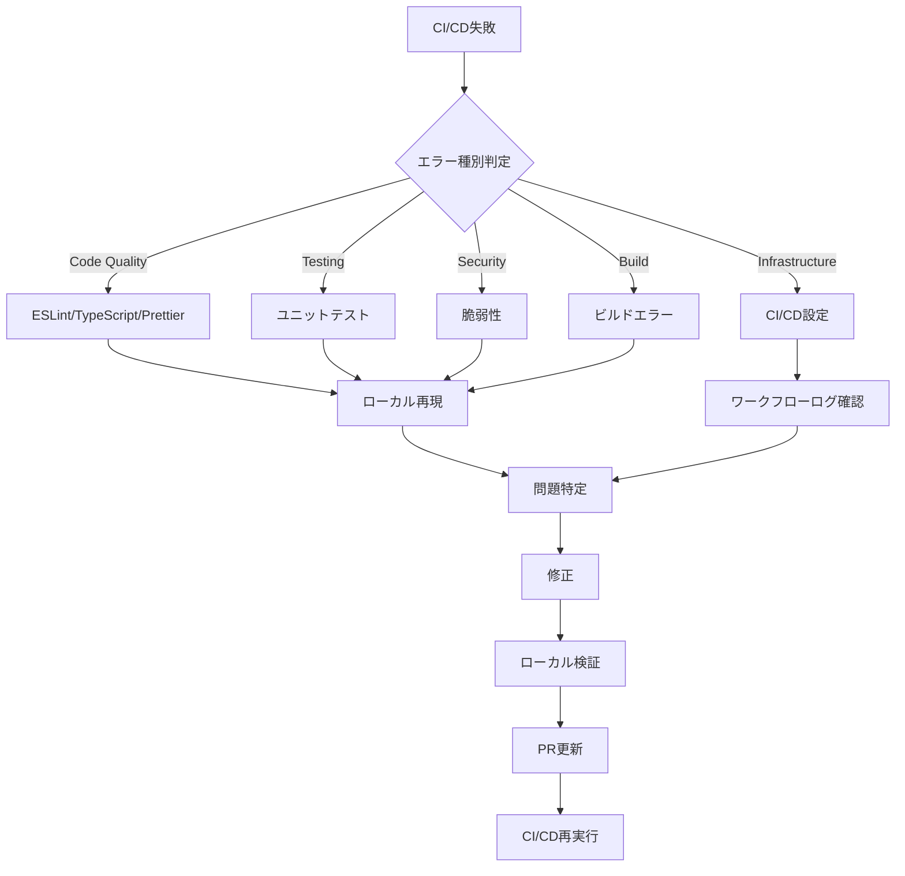

# CI/CDトラブルシューティングガイド

## 📋 目次

- [概要](#概要)
- [よくある失敗パターンと解決法](#よくある失敗パターンと解決法)
- [エラーログ解析方法](#エラーログ解析方法)
- [緊急時対応手順](#緊急時対応手順)
- [デバッグ手順](#デバッグ手順)

## 概要

CI/CDパイプラインで発生する一般的な問題とその解決方法をまとめたガイドです。エラー発生時の迅速な対応と問題解決をサポートします。

### トラブルシューティングの基本フロー



## よくある失敗パターンと解決法

### 1. Code Quality Checks失敗

#### ESLintエラー

**症状**:
```
Error: ESLint found 5 errors
src/views/LoginPage.vue:42:7 - 'userName' is assigned a value but never used
```

**原因**:
- 未使用変数の存在
- コーディングスタイル違反
- import文の未使用

**解決手順**:

```bash
# 1. ローカルでESLint実行
npm run ci:lint

# 2. 自動修正可能なエラーを修正
npm run lint

# 3. 手動修正が必要なエラーを確認
npx eslint src/views/LoginPage.vue --fix

# 4. 修正後確認
npm run ci:lint
```

**よくあるESLintエラーと対処法**:

| エラー | 原因 | 対処法 |
|--------|------|--------|
| `no-unused-vars` | 未使用変数 | 変数削除または`_`プリフィックス |
| `@typescript-eslint/no-explicit-any` | any型使用 | 具体的な型定義 |
| `no-console` | console.log使用 | logger使用に変更 |
| `vue/multi-word-component-names` | 単語1つのコンポーネント名 | 複数単語に変更 |

#### TypeScript型エラー

**症状**:
```
Error: Type 'string | undefined' is not assignable to type 'string'
src/stores/auth.ts:45:7
```

**原因**:
- 型の不一致
- nullチェック不足
- 型定義の欠落

**解決手順**:

```bash
# 1. 型チェック実行
npm run type-check

# 2. 詳細エラー確認
npx vue-tsc --noEmit

# 3. 特定ファイルのみチェック
npx vue-tsc --noEmit src/stores/auth.ts
```

**よくある型エラーと対処法**:

```typescript
// ❌ 問題: undefined可能性
const userName: string = user.name

// ✅ 解決1: Optional chaining + デフォルト値
const userName: string = user.name ?? ''

// ✅ 解決2: 型ガード
if (user.name) {
  const userName: string = user.name
}

// ❌ 問題: any型使用
const data: any = fetchData()

// ✅ 解決: 適切な型定義
interface User {
  id: number
  name: string
}
const data: User = fetchData()
```

#### Prettierフォーマットエラー

**症状**:
```
Error: Code style issues found in 3 files
src/views/LoginPage.vue
src/stores/auth.ts
```

**解決手順**:

```bash
# 1. フォーマットチェック
npm run format -- --check

# 2. 自動フォーマット適用
npm run format

# 3. 確認
npm run format -- --check
```

### 2. Testing失敗

#### ユニットテスト失敗

**症状**:
```
FAIL src/views/LoginPage.spec.ts
  LoginPage
    ✕ should render login form (234ms)

Expected: "ログイン"
Received: "Login"
```

**デバッグ手順**:

```bash
# 1. 該当テストのみ実行
npm run test:unit -- src/views/LoginPage.spec.ts

# 2. watchモードで実行
npm run test:unit -- --watch

# 3. デバッグモード
node --inspect-brk ./node_modules/.bin/vitest src/views/LoginPage.spec.ts

# 4. カバレッジ確認
npm run ci:test
open coverage/index.html
```

**よくあるテストエラーと対処法**:

| エラー | 原因 | 対処法 |
|--------|------|--------|
| `Cannot find module` | import パス誤り | パスエイリアス確認 |
| `ReferenceError: window is not defined` | DOM API使用 | jsdom環境確認 |
| `Timeout of 5000ms exceeded` | 非同期処理待機 | `await`追加・タイムアウト延長 |
| `Cannot read property of undefined` | モック不足 | モック設定追加 |

**非同期テストのデバッグ**:

```typescript
// ❌ 問題: awaitなし
test('should fetch data', () => {
  const data = fetchData()  // Promise返却
  expect(data.name).toBe('test')  // エラー
})

// ✅ 解決: async/await使用
test('should fetch data', async () => {
  const data = await fetchData()
  expect(data.name).toBe('test')
})

// ✅ タイムアウト延長
test('should fetch data', async () => {
  const data = await fetchData()
  expect(data.name).toBe('test')
}, 10000)  // 10秒
```

#### カバレッジ不足警告

**症状**:
```
Warning: Lines coverage (65%) is below recommended threshold (70%)
```

**対処法**:

```bash
# 1. カバレッジレポート確認
npm run ci:test
open coverage/index.html

# 2. 未カバー行の特定
# HTMLレポートで赤色箇所を確認

# 3. テスト追加
# 未カバーのケースに対するテストを作成

# 4. 再確認
npm run ci:test
```

**カバレッジ向上戦略**:

- **分岐網羅**: if/else両方のケースをテスト
- **エッジケース**: 空配列、null、undefinedのテスト
- **エラーハンドリング**: try-catchのcatch節をテスト
- **非同期処理**: resolve/reject両方をテスト

### 3. Build失敗

#### 依存関係エラー

**症状**:
```
Error: Cannot find module '@supabase/supabase-js'
Error resolving module specifier '@supabase/supabase-js'
```

**解決手順**:

```bash
# 1. node_modules削除
rm -rf node_modules package-lock.json

# 2. 依存関係再インストール
npm ci

# 3. ビルド実行
npm run ci:build

# 4. 特定パッケージ再インストール（必要時）
npm install @supabase/supabase-js
```

#### 環境変数未設定

**症状**:
```
Error: VITE_SUPABASE_URL is not defined
```

**解決手順**:

```bash
# 1. .env.exampleを.envにコピー
cp .env.example .env

# 2. 環境変数設定
vim .env

# 3. ローカルビルド確認
npm run build

# 4. GitHub Secrets確認（CI/CD）
gh secret list
```

#### ビルドサイズ超過

**症状**:
```
Warning: Bundle size exceeds recommended limit
dist/index.js: 1.5MB (recommended: 1MB)
```

**対処法**:

```bash
# 1. バンドル分析
npm run build -- --mode analyze

# 2. 大きい依存関係特定
npx vite-bundle-visualizer

# 3. 最適化適用
# - 動的import使用
# - 不要依存削除
# - Tree shaking確認
```

**コード分割例**:

```typescript
// ❌ 問題: 全コンポーネント静的import
import HeavyChart from './components/HeavyChart.vue'

// ✅ 解決: 動的import
const HeavyChart = defineAsyncComponent(
  () => import('./components/HeavyChart.vue')
)
```

### 4. Security失敗

#### 脆弱性検出

**症状**:
```
High severity vulnerability detected
Package: lodash
Vulnerable versions: < 4.17.21
```

**解決手順**:

```bash
# 1. 脆弱性詳細確認
npm audit

# 2. JSON形式で詳細取得
npm audit --json > audit-report.json

# 3. 自動修正試行
npm audit fix

# 4. 破壊的変更含む修正
npm audit fix --force

# 5. 手動更新
npm update lodash

# 6. 確認
npm audit --audit-level=high
```

**対処優先度**:

| 重大度 | 対応 | 期限 |
|--------|------|------|
| Critical | 即座に修正 | 24時間以内 |
| High | 優先的に修正 | 1週間以内 |
| Moderate | 計画的に修正 | 1ヶ月以内 |
| Low | 任意 | - |

#### 代替パッケージ検討

```bash
# 1. 脆弱性パッケージ特定
npm audit

# 2. 依存関係ツリー確認
npm ls [package-name]

# 3. 代替パッケージ調査
# - npmjs.comで検索
# - メンテナンス状況確認
# - ダウンロード数確認

# 4. 置き換え
npm uninstall vulnerable-package
npm install secure-alternative
```

### 5. Infrastructure/CI/CD設定エラー

#### ワークフロー構文エラー

**症状**:
```
Error: Invalid workflow file
.github/workflows/pr-quality-gate.yml: mapping values are not allowed here
```

**解決手順**:

```bash
# 1. YAML構文チェック
yamllint .github/workflows/pr-quality-gate.yml

# 2. GitHub CLI検証
gh workflow view pr-quality-gate.yml

# 3. 問題箇所特定
# インデント・スペース確認

# 4. 修正後プッシュ
git add .github/workflows/pr-quality-gate.yml
git commit -m "fix: correct workflow syntax"
git push
```

**よくあるYAMLエラー**:

```yaml
# ❌ インデント誤り
jobs:
job-name:  # インデント不足
  runs-on: ubuntu-latest

# ✅ 正しいインデント
jobs:
  job-name:
    runs-on: ubuntu-latest

# ❌ 値の区切り誤り
name:PR Quality Gate  # スペース不足

# ✅ 正しい区切り
name: PR Quality Gate
```

#### 権限不足エラー

**症状**:
```
Error: Resource not accessible by integration
Permission denied: pull_requests: write
```

**解決手順**:

```yaml
# ワークフローに権限追加
permissions:
  contents: read
  pull-requests: write  # 追加
  checks: write         # 追加
```

#### タイムアウトエラー

**症状**:
```
Error: The job running on runner has exceeded the maximum execution time of 10 minutes
```

**解決手順**:

```yaml
# 1. タイムアウト延長
jobs:
  test:
    timeout-minutes: 15  # 10 → 15分に延長

# 2. ジョブ分割
jobs:
  unit-tests:
    timeout-minutes: 10
  integration-tests:
    timeout-minutes: 10
```

## エラーログ解析方法

### GitHub Actions ログ確認

#### コマンドライン

```bash
# 1. 最新実行一覧
gh run list --limit 10

# 2. 特定実行の詳細
gh run view [run-id]

# 3. 失敗ログのみ表示
gh run view [run-id] --log-failed

# 4. 特定ジョブのログ
gh run view [run-id] --job [job-id]

# 5. ログをファイルに保存
gh run view [run-id] --log > ci-log.txt
```

#### Webインターフェース

```
1. GitHubリポジトリページ → Actions タブ
2. 失敗したワークフロー選択
3. 失敗したジョブ選択
4. エラー箇所展開
5. "View raw logs" で全ログ表示
```

### ログパターン別分析

#### ESLint/TypeScriptエラー

```
キーワード: "error", "Error:", "✕"
場所: ESLint Code Analysis / TypeScript Type Check

例:
src/views/LoginPage.vue
  42:7  error  'userName' is assigned a value but never used  @typescript-eslint/no-unused-vars

対処: ファイル・行番号から該当箇所修正
```

#### テストエラー

```
キーワード: "FAIL", "Expected:", "Received:"
場所: Run Unit Tests with Coverage

例:
FAIL src/views/LoginPage.spec.ts
  ● LoginPage › should render login form
    expect(received).toBe(expected)
    Expected: "ログイン"
    Received: "Login"

対処: テストケース・実装コード確認
```

#### ビルドエラー

```
キーワード: "Build failed", "Error:", "Cannot find module"
場所: Production Build Test

例:
✘ [ERROR] Cannot find module '@supabase/supabase-js'

対処: 依存関係確認・再インストール
```

### ローカル再現手順

```bash
# 1. CI/CDと同じコマンド実行
npm ci --prefer-offline --no-audit --no-fund

# 2. 各チェック順次実行
npm run ci:lint
npm run ci:type-check
npm run ci:test
npm run ci:build
npm run ci:security

# 3. 全チェック一括実行
npm run ci:all

# 4. エラー再現確認
# CI/CDと同じエラーが出ることを確認
```

## 緊急時対応手順

### CI/CD全体停止時の対応

#### シナリオ1: GitHub Actions障害

```bash
# 1. GitHub Status確認
open https://www.githubstatus.com/

# 2. 障害情報確認
# - Actions実行不可
# - 復旧見込み時間

# 3. 代替手段
# ローカルで全チェック実行
npm run ci:all

# 4. 手動マージ（緊急時のみ）
# 管理者権限でマージ
```

#### シナリオ2: npm registry障害

```bash
# 1. npm status確認
open https://status.npmjs.org/

# 2. キャッシュ利用
# GitHub Actionsのキャッシュが有効な場合は影響なし

# 3. ミラーレジストリ使用（必要時）
npm config set registry https://registry.npm.taobao.org/
```

### 品質ゲート一時無効化手順

**⚠️ 警告**: 緊急時のみ使用。必ずIssue作成して後で修正

```yaml
# .github/workflows/pr-quality-gate.yml

jobs:
  code-quality:
    runs-on: ubuntu-latest
    # 一時的に無効化
    if: false  # ← 追加

    steps: [...]
```

**無効化後の対応**:

```bash
# 1. Issue作成
gh issue create \
  --title "緊急: CI/CD品質ゲート一時無効化の復旧" \
  --label "priority:P0,type-infra:ci-cd" \
  --body "理由: [緊急対応の理由]
期限: 24時間以内
対応: 品質ゲート再有効化 + 問題修正"

# 2. 24時間以内に修正・再有効化
```

### ロールバック手順

#### ワークフロー設定ロールバック

```bash
# 1. 直前の正常コミット特定
git log --oneline .github/workflows/ | head -5

# 2. 特定ファイルを戻す
git checkout [commit-hash] -- .github/workflows/pr-quality-gate.yml

# 3. コミット・プッシュ
git commit -m "revert: rollback CI workflow to stable version"
git push origin main
```

#### 依存関係ロールバック

```bash
# 1. package-lock.json復元
git checkout HEAD~1 -- package-lock.json

# 2. 再インストール
npm ci

# 3. 確認
npm run ci:all

# 4. コミット
git commit -m "revert: rollback dependencies to stable version"
```

## デバッグ手順

### 段階的デバッグ戦略

```bash
# Level 1: 最小再現
npm run ci:lint  # 1つずつ実行

# Level 2: 詳細ログ
npm run ci:lint -- --debug

# Level 3: 特定ファイルのみ
npx eslint src/views/LoginPage.vue --debug

# Level 4: バイナリサーチ
# 半分ずつファイルをコメントアウトして原因箇所特定
```

### CI/CD Debug Logging

```yaml
# デバッグログ有効化
jobs:
  test:
    steps:
    - name: Enable debug logging
      run: echo "ACTIONS_STEP_DEBUG=true" >> $GITHUB_ENV

    - name: Run with verbose
      run: npm run ci:test -- --verbose
```

## 関連ドキュメント

- [CI/CDアーキテクチャ](./CI_CD_OVERVIEW.md)
- [設定変更手順](./CI_CD_CONFIGURATION.md)
- [運用・保守ガイド](./CI_CD_OPERATIONS.md)
- [クイックリファレンス](./CI_CD_QUICK_REFERENCE.md)

## バージョン履歴

| バージョン | 日付 | 変更内容 |
|-----------|------|---------|
| 1.0.0 | 2025-01-14 | 初版作成 |
