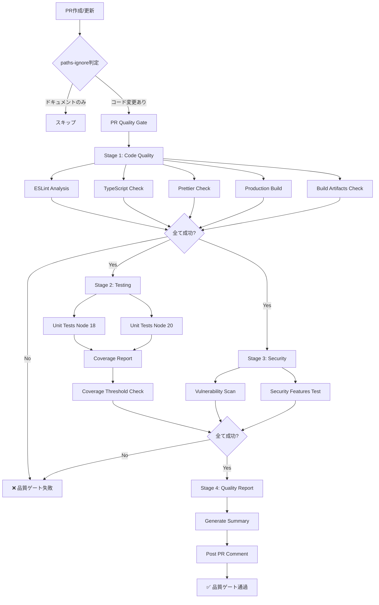
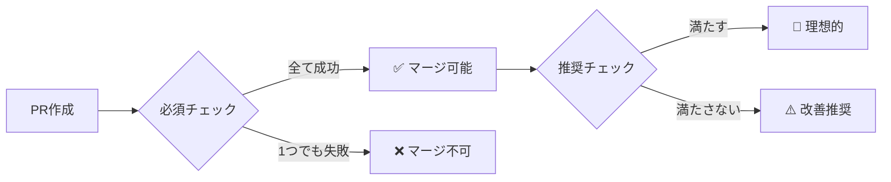

# CI/CDパイプライン - アーキテクチャ・全体像

## 📋 目次

- [概要](#概要)
- [全体アーキテクチャ](#全体アーキテクチャ)
- [ワークフロー詳細](#ワークフロー詳細)
- [品質ゲート基準](#品質ゲート基準)
- [技術スタック](#技術スタック)

## 概要

Refeel（GoalCategorizationDiary）プロジェクトのCI/CDパイプラインは、GitHub Actionsを使用した自動化された品質保証システムです。PR作成時に厳格な品質チェックを実行し、コードの品質・安全性・信頼性を担保します。

### CI/CDの目的

- **コード品質保証**: ESLint、TypeScript、Prettierによる静的解析
- **機能保証**: ユニットテストによる動作確認
- **セキュリティ保証**: npm auditによる脆弱性検査
- **ビルド保証**: 本番環境ビルドの成功確認
- **自動化**: 開発者の負担軽減と一貫した品質維持

## 全体アーキテクチャ

### パイプライン構成図



### 実行フロー概要

1. **トリガー**: PR作成・更新時
2. **並行処理**:
   - Stage 1（Code Quality）→ Stage 2（Testing）並行
   - Stage 1（Code Quality）→ Stage 3（Security）並行
3. **統合**: Stage 4（Quality Report）で全結果を集約
4. **通知**: PR コメントで品質レポート投稿

## ワークフロー詳細

### 1. PR Quality Gate（pr-quality-gate.yml）

PR作成・更新時に実行される **厳格な品質チェック** パイプライン

#### トリガー条件

```yaml
on:
  pull_request:
    branches: [ main, develop ]
    types: [opened, synchronize, reopened]
    paths-ignore:
      - 'docs/**'
      - '*.md'
      - '.gitignore'
      - 'e2e/**'
```

- **対象ブランチ**: main, develop
- **イベント**: PR作成、同期（新規コミット）、再オープン
- **除外パス**: ドキュメント、Markdown、E2Eテスト

#### 実行ジョブ詳細

##### Stage 1: Code Quality Checks（10分）

| ステップ | 内容 | 失敗条件 | タイムアウト |
|---------|------|---------|-------------|
| **ESLint** | コード品質・スタイル分析 | エラー > 0 | 10分 |
| **TypeScript** | 型チェック | 型エラー > 0 | 10分 |
| **Prettier** | フォーマット準拠確認 | 未フォーマットファイルあり | 10分 |
| **Build** | 本番ビルドテスト | ビルド失敗 | 10分 |
| **Artifacts Check** | ビルド成果物検証 | dist/index.html不在 | 10分 |

**実行時間**: 約3-5分（キャッシュ利用時）

##### Stage 2: Comprehensive Testing（15分）

| 項目 | 内容 | マトリックス |
|------|------|-------------|
| **ユニットテスト** | Vitest実行 | Node 18, 20 |
| **カバレッジレポート** | Codecov連携 | Node 20のみ |
| **カバレッジ閾値** | 推奨70%（警告のみ） | Node 20のみ |

**並行実行**: Node 18と20で同時実行
**実行時間**: 約5-8分

##### Stage 3: Security Analysis（10分）

| チェック | 内容 | 失敗条件 |
|---------|------|---------|
| **Vulnerability Scan** | npm audit実行 | High/Critical脆弱性あり |
| **Security Features** | セキュリティ機能テスト | テスト失敗 |

**実行時間**: 約2-3分

##### Stage 4: Quality Gate Summary

- 全ステージの結果を集約
- PRコメントに詳細レポート投稿
- 合格/不合格の最終判定

### 2. Quality Check CI（ci.yml）

main/developブランチへのpush時、またはPR作成時に実行される **継続的品質監視** パイプライン

#### 特徴

- **緩やかな品質チェック**: `continue-on-error: true`で警告のみ
- **並行実行**: 全ジョブが独立して並行実行
- **高速実行**: 各ジョブ5-10分のタイムアウト

#### 実行ジョブ

| ジョブ | タイムアウト | continue-on-error |
|--------|-------------|-------------------|
| lint-and-format | 5分 | true |
| type-check | 5分 | true |
| unit-tests | 10分 | true |
| build-check | 5分 | false |
| security-audit | 3分 | true |

### 3. その他のワークフロー

#### E2E Tests（e2e-tests.yml）

- **トリガー**: 手動実行またはスケジュール
- **内容**: Playwright E2Eテスト実行
- **実行時間**: 約15-20分

#### Type Generation（type-generation.yml）

- **トリガー**: Supabaseスキーマ変更時
- **内容**: データベース型定義自動生成
- **実行時間**: 約2-3分

#### Deploy（deploy.yml）

- **トリガー**: mainブランチへのマージ
- **内容**: Vercel自動デプロイ
- **実行時間**: 約5-10分

#### Auto Label（AutoLabel.yml）

- **トリガー**: PR作成時
- **内容**: PR内容に基づく自動ラベル付与

#### Issue Audit（issue-audit.yml）

- **トリガー**: スケジュール実行（週次）
- **内容**: Issue整理・自動クローズ

## 品質ゲート基準

### 必須レベル（PRマージ条件）

| 項目 | 基準 | 理由 |
|------|------|------|
| **ESLint** | エラー0件 | コード品質の最低保証 |
| **TypeScript** | 型エラー0件 | 型安全性の担保 |
| **Prettier** | フォーマット準拠 | コードスタイルの一貫性 |
| **ビルド** | 本番ビルド成功 | デプロイ可能性の確認 |
| **ユニットテスト** | 全テスト成功 | 既存機能の動作保証 |
| **セキュリティ** | High/Critical脆弱性0件 | セキュリティリスク最小化 |

### 推奨レベル（警告表示）

| 項目 | 目標値 | 現状 |
|------|--------|------|
| **カバレッジ** | 70%以上 | 監視中（警告のみ） |
| **セキュリティ** | Moderate以下対応 | 推奨対応 |

### 品質ゲート判定フロー



## 技術スタック

### CI/CDプラットフォーム

- **GitHub Actions**: ワークフロー実行エンジン
- **GitHub API**: PR コメント、ステータスチェック

### 品質チェックツール

#### 静的解析

| ツール | 設定ファイル | 用途 |
|--------|-------------|------|
| **ESLint 9.14** | `eslint.config.js` | コード品質・スタイル |
| **TypeScript 5.6** | `tsconfig.json` | 型チェック |
| **Prettier 3.3** | `.prettierrc` | フォーマット |

#### テスト

| ツール | 設定ファイル | 用途 |
|--------|-------------|------|
| **Vitest 2.1** | `vitest.config.ts` | ユニットテスト |
| **@vitest/coverage-v8** | `vitest.config.ts` | カバレッジ測定 |
| **Playwright 1.48** | `playwright.config.ts` | E2Eテスト |

#### セキュリティ

| ツール | 用途 |
|--------|------|
| **npm audit** | 脆弱性スキャン |
| **Codecov** | カバレッジレポート |

### ビルド・デプロイ

| ツール | 用途 |
|--------|------|
| **Vite 5.4** | ビルドツール |
| **Vercel** | 本番デプロイ |

### npm scripts

| コマンド | 説明 | 使用場面 |
|---------|------|---------|
| `npm run ci:lint` | ESLint実行（警告でエラー） | CI/CD |
| `npm run ci:type-check` | TypeScript型チェック | CI/CD |
| `npm run ci:test` | テスト実行（カバレッジ付き） | CI/CD |
| `npm run ci:build` | 本番ビルド | CI/CD |
| `npm run ci:security` | セキュリティ監査 | CI/CD |
| `npm run ci:all` | 全品質チェック | ローカル検証 |

### 依存関係インストール戦略

```bash
npm ci --prefer-offline --silent --no-audit --no-fund
```

- **`npm ci`**: package-lock.jsonから厳密インストール
- **`--prefer-offline`**: キャッシュ優先（高速化）
- **`--silent`**: 不要ログ抑制
- **`--no-audit`**: 監査スキップ（別途実施）
- **`--no-fund`**: 寄付メッセージ非表示

**リトライ機構**: 最大3回まで30秒間隔でリトライ

### キャッシュ戦略

```yaml
- name: Setup Node.js
  uses: actions/setup-node@v4
  with:
    node-version: '20'
    cache: 'npm'  # package-lock.jsonベースのキャッシュ

- name: Cache build artifacts
  uses: actions/cache@v4
  with:
    path: |
      dist
      node_modules/.vite
    key: build-cache-${{ runner.os }}-${{ hashFiles('package-lock.json') }}
```

**効果**: 初回3-5分 → 2回目以降1-2分

## パフォーマンス指標

### 実行時間目標

| パイプライン | 目標時間 | 実績 |
|-------------|---------|------|
| PR Quality Gate | < 15分 | 8-12分 |
| Quality Check CI | < 10分 | 5-8分 |
| E2E Tests | < 20分 | 15-18分 |

### 並行実行最適化

- **Code Quality → Testing/Security**: 並行実行
- **Testing**: Node 18/20マトリックス並行
- **全ワークフロー**: concurrency制御で重複実行キャンセル

### コスト最適化

- **タイムアウト設定**: 各ジョブ適切な上限設定
- **paths-ignore**: 不要な実行スキップ
- **キャッシュ活用**: 依存関係・ビルド成果物

## 関連ドキュメント

- [CI/CD設定変更手順](./CI_CD_CONFIGURATION.md)
- [トラブルシューティングガイド](./CI_CD_TROUBLESHOOTING.md)
- [運用・保守ガイド](./CI_CD_OPERATIONS.md)
- [クイックリファレンス](./CI_CD_QUICK_REFERENCE.md)

## バージョン履歴

| バージョン | 日付 | 変更内容 |
|-----------|------|---------|
| 1.0.0 | 2025-01-14 | 初版作成 |
