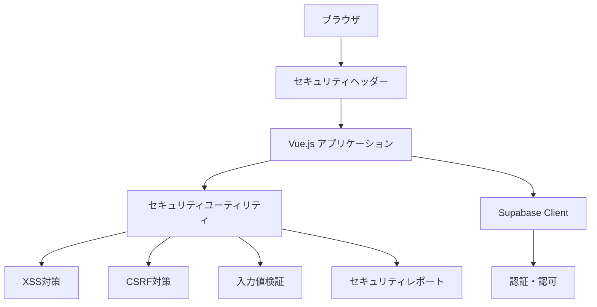

# セキュリティ実装詳細

このドキュメントでは、GoalCategorizationDiaryアプリケーションで実装されたセキュリティ機能の技術的詳細を説明します。

> **関連ドキュメント**  
> - [セキュリティガイドライン](SECURITY.md) - ポリシーと概要  
> - [セキュリティ開発ガイド](SECURITY_DEVELOPMENT.md) - 実装手順とベストプラクティス

## 📋 アーキテクチャ概要



## 🛡️ 実装されたセキュリティ機能

### 1. セキュリティヘッダー
**実装場所**: `vite.config.ts`, `index.html`

| ヘッダー | 設定値 | 目的 |
|---------|--------|------|
| Content-Security-Policy | `default-src 'self'; script-src 'self' 'unsafe-inline'...` | XSS攻撃の防止 |
| X-Frame-Options | `DENY` | クリックジャッキング防止 |
| X-XSS-Protection | `1; mode=block` | レガシーXSS保護 |
| X-Content-Type-Options | `nosniff` | MIME誤認識防止 |
| Referrer-Policy | `strict-origin-when-cross-origin` | リファラー制御 |
| Permissions-Policy | `camera=(), microphone=()...` | 不要権限の無効化 |

### 2. XSS対策
**実装場所**: `src/utils/security.ts` - `XSSProtection`クラス

```typescript
// HTMLコンテンツのサニタイゼーション（DOMPurify使用）
XSSProtection.sanitizeHTML(content: string): string

// テキスト入力のエスケープ処理  
XSSProtection.sanitizeText(input: string): string

// URL検証（危険なプロトコル除去）
XSSProtection.sanitizeURL(url: string): string | null
```

### 3. CSRF対策
**実装場所**: `src/utils/security.ts` - `CSRFProtection`クラス

```typescript
// 暗号学的に安全なトークン生成
CSRFProtection.generateToken(): string

// トークンの保存・取得（セッションストレージ）
CSRFProtection.storeToken(token: string): void
CSRFProtection.getToken(): string | null

// HTTPヘッダーへの自動追加
CSRFProtection.addTokenToHeaders(headers?: Record<string, string>): Record<string, string>
```

### 4. 入力値検証
**実装場所**: `src/utils/security.ts` - `InputValidation`クラス

```typescript
// メールアドレス形式検証
InputValidation.isValidEmail(email: string): boolean

// パスワード強度検証（8文字以上、大小英数特殊文字）
InputValidation.validatePassword(password: string): ValidationResult

// SQLインジェクション対策
InputValidation.checkForSQLInjection(input: string): boolean
```

### 5. セキュリティレポート
**実装場所**: `src/utils/security.ts` - `SecurityReporting`クラス

```typescript
// CSP違反レポート送信
SecurityReporting.reportCSPViolation(violationReport: Record<string, unknown>): Promise<void>

// セキュリティインシデント報告
SecurityReporting.reportSecurityIncident(incidentType: string, details: Record<string, unknown>): Promise<void>
```

### 6. 認証セキュリティ
**実装場所**: `src/utils/auth.ts`

```typescript
// 認証試行の監視とログ記録
logAuthAttempt(isSuccess: boolean, email: string, reason?: string): Promise<void>

// セッション有効性検証
validateSession(): Promise<boolean>
```

## 🚀 初期化と設定

**実装場所**: `src/main.ts`

```typescript
// セキュリティ機能の初期化
initializeSecurity()

// 初期化内容:
// 1. CSRFトークンの生成と保存
// 2. CSP違反監視の開始  
// 3. グローバルエラーハンドラーの設定
```

## 🏗️ 設計思想と制約事項

### 設計原則
1. **多層防御**: 複数のセキュリティ機能を組み合わせ
2. **型安全性**: TypeScriptによる静的型チェック
3. **パフォーマンス重視**: 最小限のオーバーヘッド
4. **保守性**: 明確なAPIと責務分離

### 技術的制約
- **ブラウザ互換性**: モダンブラウザ対応（ES2020+）
- **CSP制約**: 開発環境では一部制限を緩和
- **セッションストレージ**: XSS攻撃時のリスク軽減のため
- **依存関係**: DOMPurifyライブラリに依存

### パフォーマンスへの影響
| 機能 | 初期化コスト | ランタイムコスト | 最適化策 |
|------|-------------|-----------------|----------|
| XSS対策 | 低 | 中（サニタイゼーション時） | useMemoでキャッシュ |
| CSRF対策 | 低 | 低（ヘッダー追加のみ） | - |
| 入力値検証 | 低 | 低（正規表現） | 事前コンパイル |
| セキュリティレポート | 中 | 低（非同期送信） | 失敗時のリトライ制限 |

## 🔧 拡張・保守ガイド

### 新しいセキュリティ機能の追加

1. **src/utils/security.ts** に新しいクラスを追加
```typescript
export class NewSecurityFeature {
  static newMethod(): void {
    // 実装
  }
}
```

2. **型定義の追加**
```typescript
// types/security.ts（新規作成推奨）
export interface NewSecurityConfig {
  enabled: boolean;
  options: Record<string, unknown>;
}
```

3. **初期化に追加**
```typescript
// src/main.ts
import { NewSecurityFeature } from '@/utils/security'
NewSecurityFeature.initialize()
```

### 既存機能の変更

#### CSP設定の変更
```typescript
// vite.config.ts
server: {
  headers: {
    'Content-Security-Policy': "新しいCSP設定"
  }
}
```

#### サニタイゼーション設定の変更
```typescript
// src/utils/security.ts
const sanitizeConfig = {
  ALLOWED_TAGS: ['新しいタグ'],
  ALLOWED_ATTR: ['新しい属性']
}
```

### 設定の外部化

将来的に設定を外部化する場合：

```typescript
// config/security.ts
export const securityConfig = {
  xss: {
    enabled: true,
    allowedTags: ['b', 'i', 'em']
  },
  csrf: {
    enabled: true,
    tokenLength: 32
  }
}
```

## 🔍 検証とテスト

### 1. 自動テスト
```bash
# セキュリティ機能のユニットテスト
npm run test:unit -- --grep "security"

# 型チェック
npm run type-check
```

### 2. 手動検証
```javascript
// ブラウザコンソールでのテスト例
// XSS対策
XSSProtection.sanitizeHTML('<script>alert("test")</script>')

// CSRF対策  
console.log(CSRFProtection.getToken())

// 入力値検証
InputValidation.validatePassword('TestPass123!')
```

### 3. セキュリティスキャン
```bash
# 脆弱性スキャン
npm audit
npm audit fix

# 依存関係チェック
npm outdated
```

## ⚠️ 既知の問題と制限事項

### 開発環境での制限
- CSPの `unsafe-inline` `unsafe-eval` は開発時のみ
- 本番環境では厳格化が必要

### ブラウザ互換性
- Internet Explorer 11以下は非対応
- 一部のモバイルブラウザでCSP制限あり

### パフォーマンス制約
- 大量のHTMLサニタイゼーション時の処理時間
- セキュリティレポート送信時のネットワーク負荷

## 📋 関連ファイル一覧

### コアファイル
- `src/utils/security.ts` - メインセキュリティユーティリティ
- `src/utils/auth.ts` - 認証セキュリティ強化
- `src/lib/supabase.ts` - CSRF統合

### 設定ファイル  
- `vite.config.ts` - セキュリティヘッダー設定
- `index.html` - HTMLレベルセキュリティ

### コンポーネント
- `src/views/LoginPage.vue` - ログインセキュリティ
- `src/views/AccountRegisterPage.vue` - 登録セキュリティ

### ドキュメント
- `docs/SECURITY.md` - セキュリティガイドライン
- `docs/SECURITY_DEVELOPMENT.md` - 開発ガイド

---

**実装完了**: 2025-08-17  
**対応Issue**: #71  
**次回レビュー**: 2025-09-17